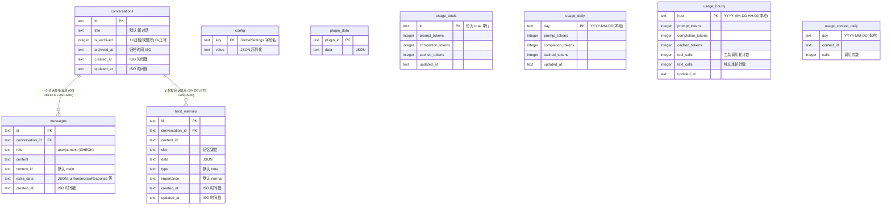
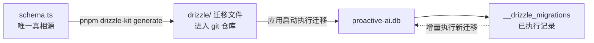

# 数据库设计（SQLite / Drizzle ORM）

本应用使用 SQLite（better-sqlite3）持久化数据，通过 Drizzle ORM 提供类型安全查询与迁移体系。

- 数据库文件：`{userData}/proactive-ai.db`（WAL 模式）
- 表结构唯一真相源：`src/main/services/store/schema.ts`
- 迁移文件：`drizzle/`（由 drizzle-kit 生成，随应用分发）

> 改表流程：改 `schema.ts` → `pnpm drizzle-kit generate` → 提交生成的迁移文件。
> 运行时由 `migrate()` 按 `__drizzle_migrations` 记录增量执行；无迁移记录的旧库会在启动时删除重建。

## 表关系总览

## 各表说明

### conversations — 对话元数据

| 字段 | 说明 |
|---|---|
| `id` | UUID 主键 |
| `title` | 对话标题，默认「新对话」，首条消息后自动截取前 30 字 |
| `is_archived` | 软删除标记：1 = 归档（列表隐藏），0 = 正常 |
| `archived_at` | 归档时间，超过保留期（7 天）由 `purgeArchived` 物理删除 |
| `created_at` / `updated_at` | ISO 时间戳，`updated_at` 为会话列表排序依据 |

### messages — 聊天消息

| 字段 | 说明 |
|---|---|
| `id` | UUID 主键 |
| `conversation_id` | 外键 → conversations，级联删除 |
| `role` | `user`（用户输入）或 `context`（AI 产出），DB 层有 CHECK 约束 |
| `content` | 消息正文 |
| `context_id` | 产生该消息时的活跃上下文 ID（`main` = 主上下文），旧数据迁移归入 `main` |
| `extra_data` | JSON 字符串：`uiRender`（交互组件树）、`rawResponse`、`toolCalls` 等 |
| `created_at` | ISO 时间戳，与 `conversation_id` 组成复合索引 |

> 框架内部消息（event-status / tool-result / compact-marker）以 `extra_data.kind` 标记落库，IPC 层映射时过滤，不渲染为气泡。

### host_memory — 通用记忆层

按「会话 + 上下文」隔离的记忆存储，单条记录为 `slot` 键位，同一会话+上下文下 slot 唯一（UNIQUE 约束）。

| 字段 | 说明 |
|---|---|
| `id` | UUID 主键 |
| `conversation_id` | 外键 → conversations，级联删除 |
| `context_id` | 所属上下文 ID |
| `slot` | 记忆键位名 |
| `data` | 记忆内容（JSON 字符串） |
| `type` / `importance` | 记忆类型与重要度（默认 `note` / `normal`） |
| `created_at` / `updated_at` | ISO 时间戳 |

### config — 全局配置

键值表，`key` 为 `GlobalSettings` 的字段名（`apiKey` / `model` / `baseURL` / `locale` / `theme` / `fontSize`），`value` 为 JSON 序列化字符串。由主进程经 IPC 读写。

### plugin_data — 插件持久化数据

一个插件一行：`plugin_id` 主键 + `data`（插件自有 JSON）。

### 用量统计表（usage_*）

由 `llm.ts` 采集每次调用的 token 数 → `addUsage()` 一次性 UPSERT 累加到 4 张表：

| 表 | 粒度 | 用途 |
|---|---|---|
| `usage_totals` | 累计（单行 `id='total'`） | 总 token、命中率（`cached/prompt`） |
| `usage_daily` | 按日（本地时区 `YYYY-MM-DD`） | 近 7 天用量趋势 |
| `usage_hourly` | 按小时（本地时区 `YYYY-MM-DD HH:00`） | 近 24 小时用量 + 工具/文本调用分项 |
| `usage_context_daily` | 按「日 × 上下文」 | 各上下文调用次数分布 |

命中率计算：`hitRate = cached / prompt`（仅 `prompt > 0` 时）。`clearUsage()` 归零累计并清空明细。

## 迁移体系

- 首次启动（或检测到无迁移记录的旧库）会删除旧库文件重建
- 打包后迁移文件位于 `resources/drizzle`（extraResources 分发）