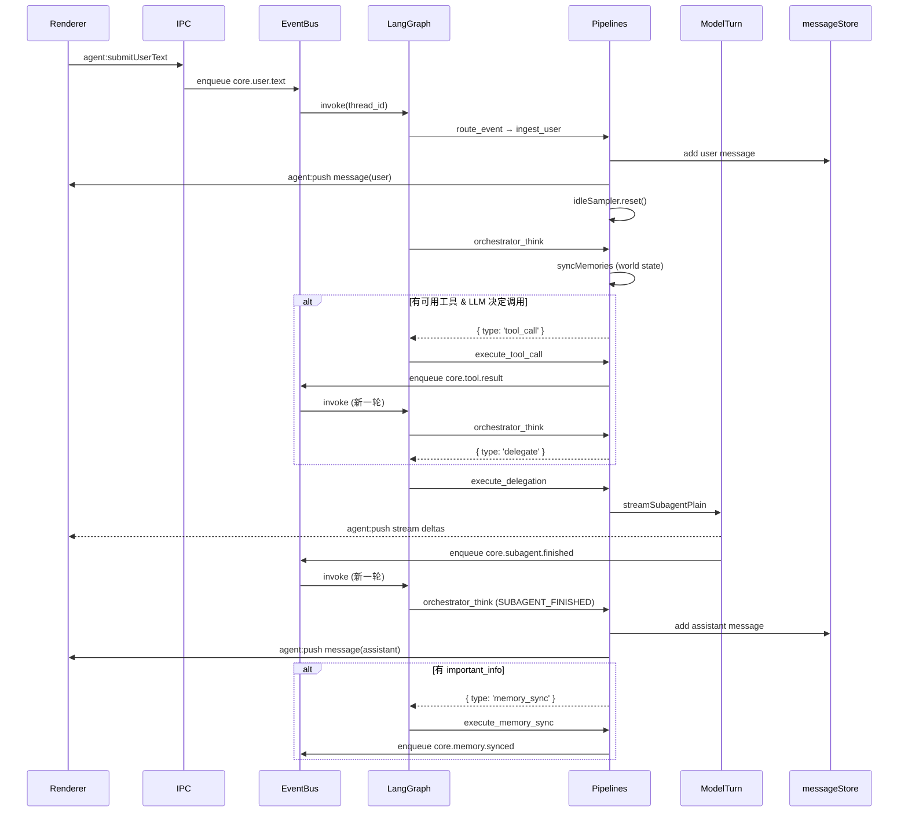
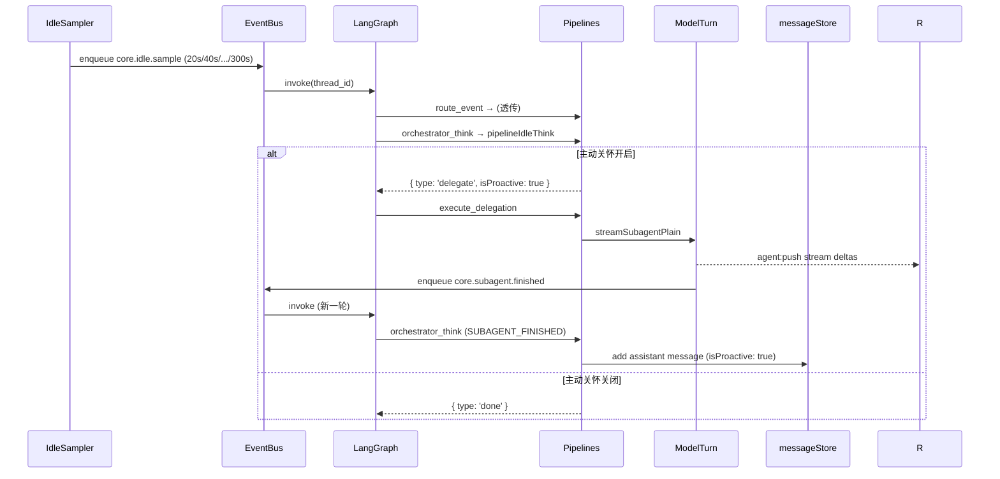

# 技术实现：智能体编排

本文从 LangGraph 核心出发，详细记录主进程智能体内核的状态机、事件流、图拓扑与数据模型。

---

## 一、架构总览

```
┌─────────────────────────────────────────────────────────┐
│                    AgentEventBus                         │
│  单队列串行消费 → LangGraphAgentRuntime.handleEvent     │
└──────────────┬──────────────────────────────────────────┘
               │ envelope
               ▼
┌─────────────────────────────────────────────────────────┐
│              LangGraph StateGraph                        │
│                                                          │
│  START → route_event → orchestrator_think ──┐           │
│                                   │          │           │
│                   ┌───────────────┼──────────┘           │
│                   │               │                      │
│          ┌────────┴───┐   ┌──────┴──────┐               │
│          │ done → END │   │ delegate    │               │
│          │            │   │ tool_call   │               │
│          │            │   │ memory_sync │               │
│          └────────────┘   └──────┬──────┘               │
│                                 │                        │
│              ┌──────────────────┼──────────────────┐     │
│              ▼                  ▼                  ▼     │
│     execute_delegation  execute_tool_call  execute_memory_sync │
│              │                  │                  │     │
│              └──────────────────┴──────────────────┘     │
│                                 │                        │
│                                END                       │
│                  (执行节点通过事件总线回环触发下一轮)       │
└─────────────────────────────────────────────────────────┘
```

核心原则：**所有事件进入同一条串行队列，由 LangGraph 图单线程消费**。idle 采样、用户消息、子智能体完成、工具结果——全部排队依次处理，避免局面竞态。

---

## 二、LangGraph 图定义

源文件：[`src/main/agent/graph/build-agent-graph.ts`](../src/main/agent/graph/build-agent-graph.ts)

### 2.1 状态注解（Annotation）

```typescript
const AgentState = Annotation.Root({
  event: Annotation<AgentEventEnvelope>({         // 当前事件信封
    reducer: (_prev, next) => next,
  }),
  routeContext: Annotation<Record<string, unknown>>({  // route_event 准备的上下文
    reducer: (_prev, next) => next,
    default: () => ({}),
  }),
  orchestratorAction: Annotation<OrchestratorAction | null>({  // 决策输出
    reducer: (_prev, next) => next,
    default: () => null,
  }),
})
```

每个字段都是**覆盖式 reducer**（`(_prev, next) => next`），即节点返回的新值直接替换旧值。状态在节点之间传递，不累加。

### 2.2 图节点

| 节点 | 职责 | 对应管线函数 |
|------|------|-------------|
| `route_event` | 根据事件类型准备上下文，更新全局状态 | `pipelineRouteEvent` |
| `orchestrator_think` | 主智能体统一决策，输出 `OrchestratorAction` | `pipelineOrchestratorThink` |
| `execute_delegation` | 委托子智能体流式生成回复 | `pipelineExecuteDelegation` |
| `execute_tool_call` | 执行插件工具调用 | `pipelineExecuteToolCall` |
| `execute_memory_sync` | 将重要信息写入对话记忆 | `pipelineExecuteMemorySync` |

### 2.3 边与路由

```
START ──→ route_event ──→ orchestrator_think ──→ 条件边
                                               │
              ┌────────────────────────────────┼──────────────────────┐
              │                                │                      │
         done → END                delegate → execute_delegation   memory_sync → execute_memory_sync
                              tool_call → execute_tool_call
              
execute_delegation ──→ END
execute_tool_call  ──→ END
execute_memory_sync──→ END
```

条件边逻辑（`orchestrator_think` 之后）：
- `action.type === 'done'` → `END`
- `action.type === 'delegate'` → `execute_delegation`
- `action.type === 'tool_call'` → `execute_tool_call`
- `action.type === 'memory_sync'` → `execute_memory_sync`

所有执行节点完成后直接 `END`。后续动作通过**事件总线回环**触发新一轮图调用。

### 2.4 检查点

使用 `MemorySaver` 作为检查点存储。`thread_id = envelope.conversationId ?? '__global__'`，保证同一会话的多轮调用共享检查点，便于后续扩展人机中断、重放等。

---

## 三、事件信封

源文件：[`src/shared/agent-events.ts`](../src/shared/agent-events.ts)

### 3.1 信封结构

| 字段 | 类型 | 说明 |
|------|------|------|
| `v` | `1` | 版本号 |
| `type` | `string` | 事件类型，开放命名空间（如 `core.user.text`、`plugin.xxx.yyy`） |
| `conversationId` | `string?` | 会话 ID，部分内核事件必填 |
| `source` | `string` | 事件来源：`kernel` / `plugin` / `subagent` |
| `correlationId` | `string?` | 关联 ID（如子智能体 runId） |
| `payload` | `object` | 按 type 解析的载荷 |
| `ts` | `number` | 时间戳 |

校验：`validateAgentEventEnvelope`——总线拒绝非法信封（缺 version、缺 type、非法 payload 等）。

### 3.2 内核事件类型

```typescript
const CORE_EVENT = {
  USER_TEXT:          'core.user.text',           // 用户发送消息
  IDLE_SAMPLE:        'core.idle.sample',         // 空闲采样
  SUBAGENT_FINISHED:  'core.subagent.finished',   // 子智能体完成
  TOOL_RESULT:        'core.tool.result',          // 工具执行结果
  MEMORY_SYNCED:      'core.memory.synced',        // 记忆同步完成
}
```

---

## 四、事件总线

源文件：[`src/main/agent/event-bus.ts`](../src/main/agent/event-bus.ts)

### 4.1 串行消费模型

```
enqueue(raw) → validate → event.validate 钩子 → event.afterEnqueue 钩子 → 排入 drain 链
                                                                               │
drain 链: job₁ → job₂ → job₃ → ...                                            │
每个 job = consumer(envelope)                                                   │
consumer = LangGraphAgentRuntime.handleEvent                                   │
```

**关键设计**：`enqueue` 不等待 consumer 处理完毕（否则在 consumer 内部再次 enqueue 会死锁），入队即返回。drain 链保证消费串行，任何 consumer 抛出的错误会被 catch 并 log，不会中断后续事件。

### 4.2 事件回环

执行节点完成后不直接继续图调用，而是通过事件总线回环：

- `execute_tool_call` → 入队 `core.tool.result` → 新一轮图调用 → `orchestrator_think` 决定是 delegate 还是再调工具
- `execute_delegation` → 子智能体完成 → 入队 `core.subagent.finished` → 新一轮图调用
- `execute_memory_sync` → 入队 `core.memory.synced` → 新一轮图调用（MEMORY_SYNCED 分支直接 done）

---

## 五、管线节点详解

源文件：[`src/main/agent/pipelines.ts`](../src/main/agent/pipelines.ts)

### 5.1 route_event：上下文准备

根据事件类型准备后续节点需要的上下文，不做决策：

| 事件类型 | 操作 |
|---------|------|
| `USER_TEXT` | 执行 `pipelineIngestUserText`（消息落盘+UI推送），重置 idle sampler |
| `SUBAGENT_FINISHED` | 提取 `subagentPayload` |
| `TOOL_RESULT` | 提取 `toolResultPayload` |
| `MEMORY_SYNCED` | 提取 `memorySyncedPayload` |
| `IDLE_SAMPLE` | 什么都不做，透传 |

### 5.2 orchestrator_think：统一决策

主智能体的核心决策节点，根据事件类型走不同分支：

#### USER_TEXT 路径

```
USER_TEXT → pipelineIngestUserText（消息落盘）
         → pipelineSyncMemoriesUserText（world state 更新）
         → 有可用工具？→ pipelineAgentThink（非流式 LLM 调用）
                         → 有 tool_calls → { type: 'tool_call' }
                         → 无 tool_calls → { type: 'delegate' }
         → 无可用工具 → { type: 'delegate' }
```

#### IDLE_SAMPLE 路径

```
IDLE_SAMPLE → pipelineIdleThink
            → 无活跃会话 → done
            → 主动关怀未开启 → done
            → 主动关怀已开启 → { type: 'delegate', isProactive: true }
```

无冷却期、无空闲时长门控。idle sample 到达后，只要主动关怀开关打开，就直接委托子智能体，由模型自行判断是否需要主动关怀。

#### SUBAGENT_FINISHED 路径

```
SUBAGENT_FINISHED → 回复落盘 + UI 推送
                  → 有 important_info → { type: 'memory_sync' }
                  → 无 important_info → 更新 world state → done
```

#### TOOL_RESULT 路径

```
TOOL_RESULT → 提取工具结果 + 原始上下文 → { type: 'delegate' }
```

工具执行完成后，带着工具结果委托子智能体生成最终回复。

### 5.3 execute_delegation：委托子智能体

```
pipelineExecuteDelegation → subAgentRunner.startRun({ conversationId, runId, subagentSystemPrompt, userTask, ... })
                         → worldStore.patch({ activeSubagentRunId: runId })
```

子智能体异步运行，流式推送增量给 Renderer，完成后投递 `core.subagent.finished`。

### 5.4 execute_tool_call：执行插件工具

```
pipelineExecuteToolCall → pipelineCallTools（逐个调用插件工具）
                       → 入队 core.tool.result（携带工具结果 + 原始上下文）
```

### 5.5 execute_memory_sync：记忆写入

```
pipelineExecuteMemorySync → 合并 important_info 到 conversation.memory
                         → 触发 memory 钩子
                         → 入队 core.memory.synced
```

---

## 六、子智能体

源文件：[`src/main/agent/subagent-runner.ts`](../src/main/agent/subagent-runner.ts)

### 6.1 运行流程

```
startRun(opts) → void this.run(opts)

run:
  modelTurn.streamSubagentPlain(systemPrompt, userTask, globalSettings, onDelta)
    → onDelta: pushStream({ kind: 'stream', streamKind: 'subagent' })
  → pushStream({ kind: 'stream', done: true })
  → finish() → bus.enqueue(core.subagent.finished)
```

### 6.2 子智能体与主模型的区别

| 特性 | 主模型（streamMainTurn） | 子智能体（streamSubagentPlain） |
|------|------------------------|------------------------------|
| 输出格式 | JSON（`reply` + `important_info`） | 纯文本流 |
| JSON 解析 | 解析 `reply` 字段作为增量推送 | 不解析，原样推送 |
| 历史上下文 | 携带对话历史 + important_info | 仅 systemPrompt + userTask |
| 工具调用 | 支持 | 不支持 |
| 流式标记 | `streamKind: 'main'` | `streamKind: 'subagent'` |

---

## 七、空闲采样器

源文件：[`src/main/ai-desktop/src/main/agent/idle.ts`](../src/main/agent/idle.ts)

### 7.1 指数退避机制

```
20s → 40s → 80s → 160s → 300s → 停止
```

- 起始间隔：**20s**
- 退避因子：2
- 最大间隔：300s（5 分钟）
- **达到最大间隔后不再继续入队**，采样器停止
- 只有 `reset()` 才会重新从 20s 开始

### 7.2 重置触发

| 触发者 | 触发时机 |
|--------|---------|
| `pipelineRouteEvent` | 收到 `USER_TEXT` 事件时 |

用户发消息后，采样器从 20s 重新开始指数退避。

### 7.3 采样事件处理

每次 `IDLE_SAMPLE` 到达 `pipelineIdleThink`：
1. 检查是否有活跃会话
2. 检查主动关怀是否开启（全局 + 会话级）
3. 全部通过 → 委托子智能体（`isProactive: true`），由模型决定是否发送关怀消息

---

## 八、局面记忆（World State）

源文件：[`src/main/agent/world-state-store.ts`](../src/main/agent/world-state-store.ts)

### 8.1 数据结构

```typescript
interface WorldStateV1 {
  v: 1
  lastUserActivityAt: number        // 用户最后活动时间
  lastAssistantMessageAt?: number   // 助手最后回复时间
  activeSubagentRunId?: string      // 当前活跃的子智能体 runId
}
```

存储路径：`userData/world-state.json`，按 `conversationId` 分 key。

### 8.2 写入时机

| 字段 | 写入者 | 时机 |
|------|--------|------|
| `lastUserActivityAt` | `pipelineSyncMemoriesUserText` | 用户消息落盘后 |
| `lastAssistantMessageAt` | `SUBAGENT_FINISHED` 分支 | 子智能体回复落盘后（无 important_info 时） |
| `activeSubagentRunId` | `pipelineExecuteDelegation` | 委托子智能体时写入 runId |
| `activeSubagentRunId` | `SUBAGENT_FINISHED` 分支 | 子智能体回复落盘后清除 |

---

## 九、决策类型（OrchestratorAction）

```typescript
type OrchestratorAction =
  | { type: 'done' }                    // 无需动作
  | { type: 'delegate'; ... }           // 委托子智能体
  | { type: 'tool_call'; toolCalls; ... } // 调用插件工具
  | { type: 'memory_sync'; memory }     // 同步记忆
```

| 决策类型 | 触发条件 | 后续动作 |
|---------|---------|---------|
| `done` | 无需处理 / 主动关怀关闭 / 无活跃会话 | END |
| `delegate` | USER_TEXT / IDLE_SAMPLE / TOOL_RESULT | 执行子智能体 |
| `tool_call` | USER_TEXT + 有可用工具 + LLM 决定调用 | 执行工具 → 回环 |
| `memory_sync` | SUBAGENT_FINISHED + 有 important_info | 写入记忆 → 回环 |

---

## 十、IPC 通道

| 通道 | 方向 | 说明 |
|------|------|------|
| `invoke('agent:submitUserText', { conversationId, text, userMessageId? })` | R→M | 入队用户文本；立即返回 `{ ok, error? }`，不等待模型 |
| `webContents.send('agent:push', payload)` | M→R | 流式/落盘消息推送 |

已移除：`chat:send`、`agent:activityPing`。

### `agent:push` 载荷（AgentStreamPushV1）

| kind | 字段 | 说明 |
|------|------|------|
| `stream` | `conversationId`, `runId`, `delta`, `done`, `streamKind?` | 流式增量 |
| `message` | 完整 `ChatMessage` | 权威落盘内容，Renderer upsert |
| `error` | `conversationId?`, `message` | 错误通知 |

---

## 十一、钩子系统

源文件：[`src/main/agent/hook-registry.ts`](../src/main/agent/hook-registry.ts)

### 11.1 挂载点

| 挂载点 | 触发时机 |
|--------|---------|
| `event.validate` | 事件入队校验后 |
| `event.afterEnqueue` | 事件入队后 |
| `orchestrator.beforeHandle` | 图调用前 |
| `orchestrator.afterHandle` | 图调用后 |
| `model.beforeCall` | LLM 调用前 |
| `model.afterOutput` | LLM 输出后 |
| `subagent.beforeStart` | 子智能体启动前 |
| `subagent.streamChunk` | 子智能体流式增量 |
| `subagent.afterFinished` | 子智能体完成后 |
| `memory.beforeDialogueWrite` | 对话记忆写入前 |
| `memory.afterDialogueWrite` | 对话记忆写入后 |
| `memory.beforeWorldWrite` | 局面记忆写入前 |
| `memory.afterWorldWrite` | 局面记忆写入后 |
| `ipc.beforeSendStream` | 流式推送 Renderer 前 |

挂载点为开放 `string` 类型，插件可自定义挂载点。

### 11.2 插件接入

- `PluginContext.agent`：`enqueueEvent(envelope)`、`registerHook(mountPoint, handler)`
- 主进程在 `initPlugins` 前 `pluginRegistry.setAgentBridge(...)`

---

## 十二、日志跟踪

源文件：[`src/main/agent/tracing.ts`](../src/main/agent/tracing.ts)

### 12.1 TraceEntry 结构

```typescript
type TraceEntry = {
  ts: number
  level: 'chain' | 'llm' | 'tool' | 'node' | 'error'
  event: 'start' | 'end' | 'error'
  runId: string
  parentRunId?: string
  name?: string
  threadId?: string
  inputs?: unknown
  outputs?: unknown
  error?: string
}
```

### 12.2 写入与轮转

- 串行写入 `userData/agent-trace.jsonl`（每行一条 JSON）
- 每 5 分钟检查文件大小，超过 **2MB** 自动轮转
- 轮转策略：`agent-trace.jsonl` → `agent-trace.0.jsonl` → `agent-trace.1.jsonl` → `agent-trace.2.jsonl`
- 最多保留 **3 个**历史文件，超出自动删除最老的

### 12.3 错误收集

- `ErrorRing`：内存中保留最近 **50 条**错误条目
- 通过 `traceLogger.getRecentErrors()` 获取
- 通过 `traceLogger.clearErrors()` 清空

### 12.4 生命周期

- `AgentTraceLogger` 在 `createAgentRuntime` 中创建
- `traceLogger.stop()` 在应用 `window-all-closed` 时调用，停止定时清理

### 12.5 调试模式

设置环境变量 `PROACTIVE_DEBUG_AGENT=1`，主进程会输出 `[agent-debug] invoke start/done`（含 `thread_id`、`type`）。

---

## 十三、完整事件流（Mermaid）

### 13.1 用户消息主路径



### 13.2 主动关怀路径



---

## 十四、模块清单

| 文件 | 职责 |
|------|------|
| `event-bus.ts` | 事件总线：校验 → 钩子 → 串行消费 |
| `hook-registry.ts` | 钩子注册与调用 |
| `model-turn.ts` | 主模型流式 + JSON 解析；子智能体纯文本流 |
| `orchestrator.ts` | `createAgentRuntime`：装配依赖、编译图、连接总线消费者 |
| `langgraph-runtime.ts` | `graph.invoke` + `configurable.thread_id`；失败时推送错误 |
| `graph/build-agent-graph.ts` | LangGraph `StateGraph` 定义：节点、边、条件路由 |
| `pipelines.ts` | 各节点的管线步骤实现 |
| `runtime-deps.ts` | `AgentRuntimeDeps` 类型定义 |
| `world-state-store.ts` | 局面记忆 JSON 文件读写 |
| `subagent-runner.ts` | 子智能体流式推送 + 完成事件投递 |
| `idle.ts` | 空闲采样器（指数退避） |
| `tracing.ts` | 日志跟踪：串行写入、文件轮转、错误收集环 |

---

## 十五、配置与模型协议

- 全局/会话设置已移除 `maxTriggers` / `defaultMaxTriggers` / `proactiveCooldownUntil`。
- 主动关怀仅受一个控制：**开关**（`proactiveEnabled`，全局 + 会话级）。
- 主模型 JSON 协议：`{ "reply": "...", "important_info": ["..."] }`（见 [`src/shared/constants.ts`](../src/shared/constants.ts)）。
- 子智能体输出纯文本，不做 JSON 解析。
