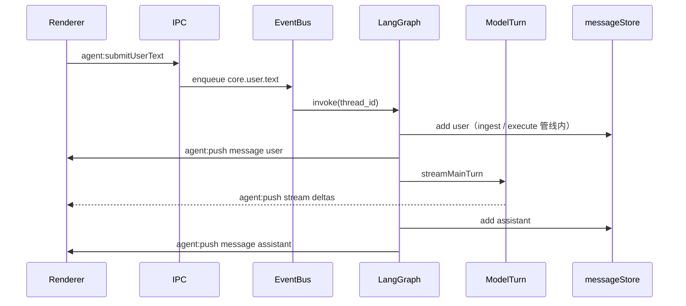

# 技术实现：智能体编排

本文记录主进程智能体内核的接口与数据流，与《架构-主动对话与统筹》对应。

## 事件信封（开放 type）

| 字段 | 类型 | 说明 |
|------|------|------|
| `v` | `1` | 版本 |
| `type` | `string` | 任意命名空间字符串，如 `core.user.text`、`plugin.xxx.yyy` |
| `conversationId` | `string?` | 会话 id，部分内核事件必填 |
| `source` | `string` | `kernel` / `plugin` / `subagent` 等 |
| `correlationId` | `string?` | 关联 id（如子智能体 runId） |
| `payload` | `object` | 按 type 解析 |
| `ts` | `number` | 时间戳 |

校验：`validateAgentEventEnvelope`（[`src/shared/agent-events.ts`](../src/shared/agent-events.ts)）。总线拒绝非法信封。

### 内核 type 常量

定义于 `CORE_EVENT`：`core.user.text`、`core.user.activity`、`core.idle.sample`、`core.subagent.finished`。

## 运行时日志（主进程）

- 默认仅在异常时打印（如 `[langgraph] invoke failed`、`[agent-bus] invalid envelope`）。成功路径的 LangGraph **不会**刷屏，所以控制台里可能看不到「和图相关」的日志。
- 需要跟踪每次 `invoke` 时：在启动前设置环境变量 **`PROACTIVE_DEBUG_AGENT=1`**（例如 PowerShell：`$env:PROACTIVE_DEBUG_AGENT='1'; npm run dev`），主进程会输出 `[agent-debug] invoke start/done`（含 `thread_id`、`type`）。
- 主进程 `console` 一般出现在 **启动应用的终端**；从桌面快捷方式启动时可能没有终端，可用上述方式从命令行启动以便查看。

## IPC

| 通道 | 方向 | 说明 |
|------|------|------|
| `invoke('agent:submitUserText', { conversationId, text, userMessageId? })` | R→M | 入队用户文本；立即返回 `{ ok, error? }`，不等待模型 |
| `invoke('agent:activityPing', conversationId)` | R→M | 刷新局面记忆中的用户活动时间 |
| `webContents.send('agent:push', payload)` | M→R | 流式/落盘消息推送（见下表） |

已移除：`chat:send`。

### `agent:push` 载荷 `AgentStreamPushV1`

- `kind: 'stream'`：`conversationId`、`runId`、`delta`、`done`、`streamKind?: 'main' | 'subagent'`
- `kind: 'message'`：完整 `ChatMessage`（权威落盘内容，Renderer `upsert`）
- `kind: 'error'`：`conversationId?`、`message`

## 主进程模块（`src/main/agent/`）

| 文件 | 职责 |
|------|------|
| `event-bus.ts` | `enqueue` → `event.validate` / `event.afterEnqueue` 钩子 → 编排器消费 |
| `hook-registry.ts` | 多挂载点 `register` / `invokeAll` |
| `model-turn.ts` | 主模型流式 + JSON 解析（`reply` / `important_info`）；子智能体纯文本流 |
| `orchestrator.ts` | `createAgentRuntime`：装配依赖、编译图、将总线消费者设为 `LangGraphAgentRuntime.handleEvent` |
| `langgraph-runtime.ts` | `graph.invoke` + `configurable.thread_id`；失败时 `agent:push` `kind: 'error'` |
| `graph/build-agent-graph.ts` | LangGraph `StateGraph`：`ingest_user` → `memory_sync_user` → `execute_user` 等；`MemorySaver` 检查点 |
| `pipelines.ts` | 各节点调用的管线步骤（ingest / 同步记忆 / 主轮次 / activity / idle / subagent） |
| `runtime-deps.ts` | `AgentRuntimeDeps`（hooks、modelTurn、worldStore、subAgentRunner、pushStream、活跃会话 id） |
| `world-state-store.ts` | 局面记忆 JSON 文件 `userData/world-state.json` |
| `subagent-runner.ts` | 子智能体流式 `agent:push`，结束 `enqueue(core.subagent.finished)` |
| `idle.ts` | 定时 `core.idle.sample` |

## 钩子挂载点（示例）

`event.validate`、`event.afterEnqueue`、`orchestrator.beforeHandle`、`orchestrator.afterHandle`、`model.beforeCall`、`model.afterOutput`、`subagent.beforeStart`、`subagent.streamChunk`、`subagent.afterFinished`、`memory.beforeDialogueWrite`、`memory.afterDialogueWrite`、`memory.beforeWorldWrite`、`memory.afterWorldWrite`、`ipc.beforeSendStream`。

## 插件

- [`PluginContext.agent`](../src/main/plugins/context.ts)：`enqueueEvent(envelope)`、`registerHook(mountPoint, handler)`  
- 主进程在 `initPlugins` 前 `pluginRegistry.setAgentBridge(...)`。  
- 已移除：`PluginHooks.onTrigger`、`runOnTrigger`。

## 子智能体结束 → 双记忆顺序

1. `core.subagent.finished` 由 `SubAgentRunner` 投递。  
2. 编排器 `handleSubAgentFinished`：**先** `messageStore.add` + `kind: 'message'`（对话记忆），**再** `worldStore.patch`（清除 `activeSubagentRunId` 等局面字段）。

流式阶段不写消息落盘终态。

## LangGraph 拓扑与线程

- **状态**：`event`（当前信封）、`userTurnContext`（ingest 后填充，供记忆同步与主轮次使用）。
- **`thread_id`**：`envelope.conversationId ?? '__global__'`，与 [`langgraph-runtime.ts`](../src/main/agent/langgraph-runtime.ts) 中 `invoke` 的 `configurable.thread_id` 一致，用于同一会话多轮与检查点隔离。
- **检查点**：`MemorySaver`（[`build-agent-graph.ts`](../src/main/agent/graph/build-agent-graph.ts) 编译选项），便于后续扩展人机中断、重放等。
- **入口路由**：`START` → `routeEventToNode(event)` → `ingest_user` | `activity` | `idle` | `subagent_finished` | `plugin_sink`。
- **用户文本路径**：`ingest_user` →（有 `userTurnContext` 则）`memory_sync_user` → `execute_user` → `END`；无上下文则 `ingest_user` 直接 `END`。
- **流式展示**：主模型协议为 JSON（`reply` / `important_info`）。推给前端的增量仅取自 JSON 内 **`reply` 字符串** 的已解析片段，避免界面出现 `reply:` 等裸 JSON；落盘仍以解析后的 `reply` 为准。
- **事件串行**：`AgentEventBus` 对编排器 **单队列** 消费，避免 idle 采样与用户消息在长耗时生成期间交叉写入局面。
- **其它节点**：`activity` / `idle` / `subagent_finished` / `plugin_sink` 各自执行对应 pipeline 后 `END`（插件类事件当前为编排层 sink，可扩展）。

## 用户消息主路径（Mermaid）

## 配置与模型协议

- 全局/会话设置已移除 `maxTriggers` / `defaultMaxTriggers`。  
- 模型 JSON 仅含 `reply`、`important_info`（见 [`src/shared/constants.ts`](../src/shared/constants.ts)）。
