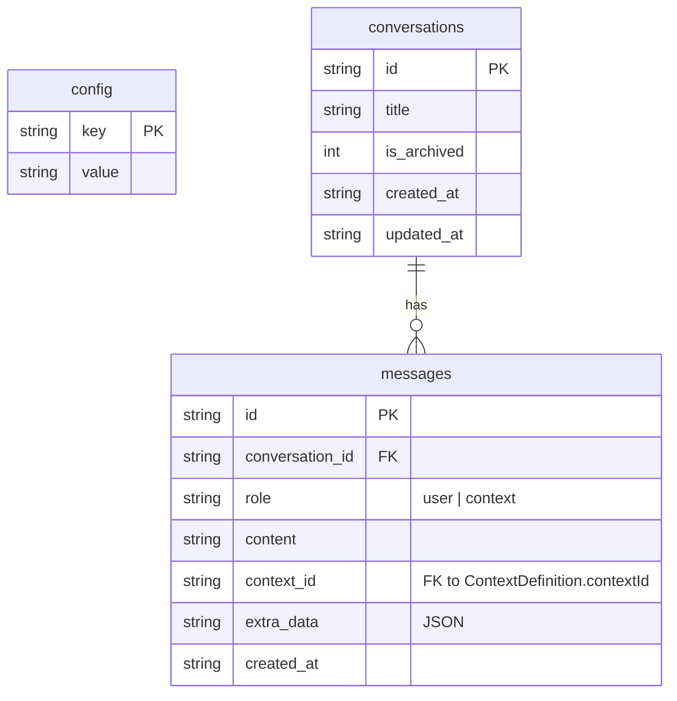
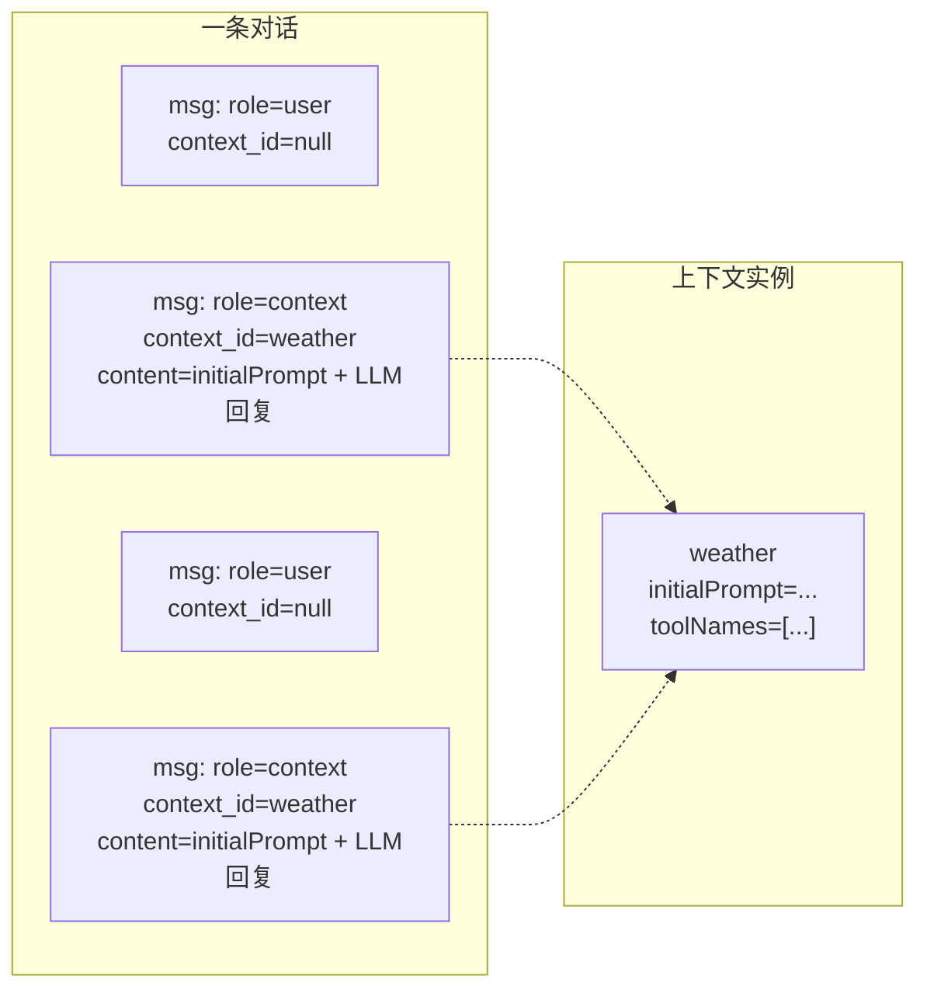
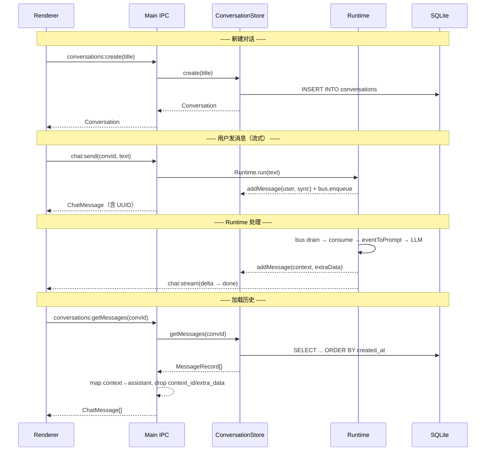

# Database Schema

## 存储层设计

统一使用 SQLite（better-sqlite3）+ **Drizzle ORM**。**无任何 JSON 文件残留**（含 `config.json` 已迁移至 SQLite `config` 表并删除源文件）。数据库文件位置：

```
app.getPath('userData') / proactive-ai.db
```

### 架构分层

```
┌─────────────────────────┐
│  ConversationStore      │  ← Business CRUD, 使用 Drizzle 类型安全查询
│  GlobalConfigStore      │
├─────────────────────────┤
│  Drizzle ORM (schema)   │  ← 表定义在 schema.ts，自动生成类型
├─────────────────────────┤
│  better-sqlite3         │  ← 原生 SQLite 驱动
└─────────────────────────┘
```

- 表定义见 `src/main/services/store/schema.ts`，作为类型单源。
- Drizzle 查询直接返回 camelCase 属性名，无需 `Db*` / `rowTo*` 映射层。
- `extra_data` 的 JSON 序列化/反序列化在 store 层手动处理（SQLite 无原生 JSON 列）。

---

## 设计原则

- **存储层不向 LLM API 角色看齐**。`messages` 表只有两种角色：`user` 和 `context`。
- `context` 包含框架在某个上下文内产生的所有内容：系统提示词、LLM 回复、工具结果、上下文注入等。
- `context_id` 标记每条消息产生时的活跃上下文，支持重放时重建上下文结构。
- 渲染层看到的 `ChatMessage.role` 是 `user | assistant`，由 IPC 层映射。

---

## E-R 关系图



---

## 表结构

### config

| 列 | 类型 | 说明 |
|---|---|---|
| `key` | TEXT PK | 配置键名 |
| `value` | TEXT | JSON 序列化的配置值 |

替代原有的 `config.json` 文件。

| key | value 示例 |
|---|---|
| `theme` | `"dark"` |
| `fontSize` | `14` |
| `apiKey` | `"sk-..."` |
| `model` | `"gpt-4"` |
| `baseURL` | `"https://api.openai.com/v1"` |

---

### conversations

| 列 | 类型 | 说明 |
|---|---|---|
| `id` | TEXT PK | UUID v4 |
| `title` | TEXT | 对话标题，用户可修改 |
| `is_archived` | INTEGER | 软删除标记 |
| `created_at` | TEXT | ISO 8601 |
| `updated_at` | TEXT | ISO 8601，有新消息时更新 |

---

### messages

| 列 | 类型 | 说明 |
|---|---|---|
| `id` | TEXT PK | UUID v4 |
| `conversation_id` | TEXT FK | 所属对话，ON DELETE CASCADE |
| `role` | TEXT | `user` = 用户原始输入，`context` = 上下文内框架产出（LLM 回复、工具结果、系统注入等） |
| `content` | TEXT | 消息正文 |
| `context_id` | TEXT | 消息产生时的活跃上下文 ID，指向 `ContextDefinition.contextId`（如 `'main'`、`'weather'`）；用户消息为 `NULL` |
| `extra_data` | TEXT | JSON，详见下方 |
| `created_at` | TEXT | ISO 8601 |

索引：`(conversation_id, created_at)`

---

## 角色映射

```
┌─────────────────────┐      IPC 边界      ┌──────────────────────┐
│      Storage        │                     │      Renderer        │
│  MessageRecord      │                     │  ChatMessage         │
│                     │                     │                      │
│  role: 'user'    ──┼─────────────────────│──> role: 'user'      │
│  role: 'context' ──┼─────────────────────│──> role: 'assistant'  │
│                     │                     │                      │
│  context_id      ──┼─────────────────────│── (dropped)           │
│  extra_data      ──┼─────────────────────│── (dropped)           │
└─────────────────────┘                     └──────────────────────┘
```

---

## extra_data 结构

`messages.extra_data` 是一条消息背后完整的事件链路记录。结构如下：

```typescript
interface MessageExtraData {
  events: AgentEventEnvelope[]
  prompt: string
  rawResponse: {
    content: string
    finishReason: string
    usage?: {
      promptTokens: number
      completionTokens: number
      totalTokens: number
    }
  }
  toolCalls?: {
    toolName: string
    arguments: Record<string, unknown>
    result: ToolResult
    durationMs: number
  }[]
}
```

---

## 与上下文的集成

每条消息通过 `context_id` 关联到当时的活跃上下文。重放历史时按此重建：



---

## 与 Runtime 的交互流程



---

## 建表策略

应用尚未发行任何版本，无存量数据需要升级，因此不设迁移体系。
`DatabaseService.init()` 每次启动执行幂等 DDL（`CREATE TABLE IF NOT EXISTS`）即可。

将来 schema 演进时：直接在 `database.ts` 的 `ensureSchema()` 中追加 DDL 语句。
